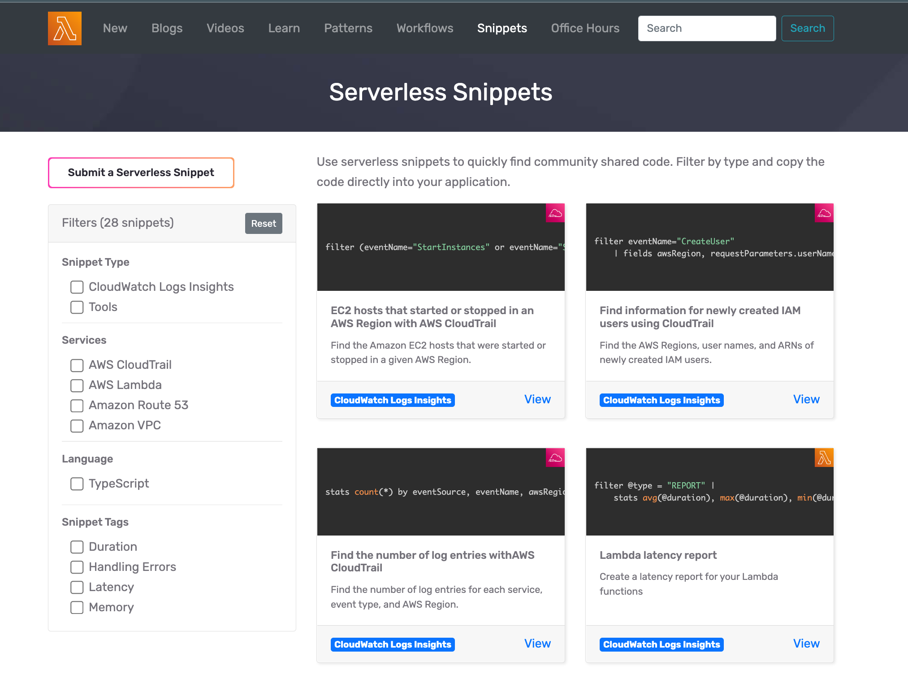

<div align="center">

<h1>⚡️ Serverless Snippets</h1>
<p>Discover, Explore and Share Serverless Snippets.</>

<hr />



  <h3>Features: Discover and explore reuseable code samples, Filter snippets, 1 click deploy, Supports any programming language, and much more...</h3>

 [View Snippets](https://serverlessland.com/snippets)

</div>

<hr/>

This repo contains Serverless Snippets that you can copy to help develop your own projects.

These snippets are hosted on [Serverless Land](https://serverlessland.com/snippets).

_We accept other types of code snippets you may find useful for others_

- Learn more about these snippets at https://serverlessland.com/snippets.
- To learn more about submitting a snippet, read the [publishing guidelines page](https://github.com/aws-samples/serverless-snippets/blob/main/PUBLISHING.md).

Important: this application could use various AWS services and there are costs associated with these services after the Free Tier usage - please see the [AWS Pricing page](https://aws.amazon.com/pricing/) for details. You are responsible for any AWS costs incurred. No warranty is implied in this example.

## Requirements

* AWS CLI already configured with Administrator permission
* [NodeJS 14.x installed](https://nodejs.org/en/download/)

## Deployment Instructions

1. [Create an AWS account](https://portal.aws.amazon.com/gp/aws/developer/registration/index.html) if you do not already have one and login.

1. [Install Git](https://git-scm.com/book/en/v2/Getting-Started-Installing-Git) and [install the AWS Serverless Application Model CLI](https://docs.aws.amazon.com/serverless-application-model/latest/developerguide/serverless-sam-cli-install.html) on your local machine.

1. Create a new directory and navigate to that directory in a terminal.

1. Clone this repo:

```
git clone https://github.com/aws-samples/serverless-snippets
```

Each subdirectory contains the snippet code shown on the website.

----
Copyright 2022 Amazon.com, Inc. or its affiliates. All Rights Reserved.

SPDX-License-Identifier: MIT-0
